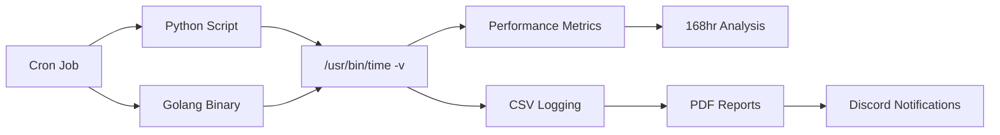

# Server Monitoring Migration: Legacy Python vs. Modern Golang


-orange)


## 🚀 Quick Impact Summary
| 📊 Memory Reduction | ⚡ CPU Efficiency | 🎯 Test Duration | 🏗️ Architecture |
|------------------|------------------|------------------|------------------|
| **15x Lower Usage** | **3x Faster** | **168 Hours** | **Edge-Ready** |

## 📖 Executive Summary
This project demonstrates a comprehensive **Refactoring and Performance Optimization** case study with direct applications to **DevOps Engineering** and **IoT Edge Computing**. 

The migration transformed a resource-intensive Python monitoring script into an ultra-efficient Golang application, achieving **15x memory reduction** while maintaining full functionality on low-spec VPS environments.

Currently conducting a **168-hour continuous stress test** to validate long-term stability, memory management, and production readiness for edge deployment scenarios.

---

## 🚧 Benchmark Results (1-Hour Snapshot)
> **Phase 1 Results:** Initial metrics captured on production server. Full 168-hour stability report in progress.

### 📊 Performance Comparison
| Metric | 🐍 Legacy Python | 🐹 Modern Golang | **Improvement** |
|--------|-----------------|------------------|----------------|
| **Memory Usage (RSS)** | 185,592 KB (~185 MB) | 12,332 KB (~12 MB) | **15x More Efficient** 🚀 |
| **User CPU Time** | 2.89s | 0.87s | **3x Lower Load** |
| **Execution Speed** | 41.66s | 26.28s | **37% Faster** |
| **Page Faults** | 50,109 | 2,117 | **96% Reduction** |

### 💼 Business Impact
- **Infrastructure Cost**: 93% memory reduction = lower cloud bills
- **Scalability**: Single binary deployment vs Python dependencies
- **Maintenance**: No virtual environment management required
- **IoT Readiness**: Perfect for edge devices with limited resources

### 🔍 Raw Log Evidence
Production server benchmark logs captured with `/usr/bin/time -v` for kernel-level accuracy.

<details>
<summary><b>🐍 Python Benchmark Log</b></summary>

```text
Command being timed: "/opt/monitoring/env/bin/python3 /opt/monitoring/monitor_server.py --log"
User time (seconds): 2.89
System time (seconds): 3.86
Percent of CPU this job got: 16%
Elapsed (wall clock) time (h:mm:ss or m:ss): 0:41.66
Maximum resident set size (kbytes): 185592  <-- CRITICAL: High Memory Consumption
Minor (reclaiming a frame) page faults: 50109
Exit status: 0
```
</details>

<details>
<summary><b>🐹 Golang Benchmark Log</b></summary>

```text
Command being timed: "./monitor-app --log"
User time (seconds): 0.87
System time (seconds): 2.55
Percent of CPU this job got: 13%
Elapsed (wall clock) time (h:mm:ss or m:ss): 0:26.28
Maximum resident set size (kbytes): 12332   <-- OPTIMIZED: Very Low Footprint
Minor (reclaiming a frame) page faults: 2117
Exit status: 0
```
</details>

*(Full logs available in `benchmark-results/raw-logs/`)*

---

## 📅 168-Hour Stability Challenge
**Objective:** Validate production readiness through continuous stress testing

| **Timeline** | **Status** | **Target** |
|--------------|------------|------------|
| **Start Date**: Feb 5, 2025 07:00 WIB | 🟢 **Running** | Initial performance capture |
| **End Date**: Feb 12, 2025 07:00 WIB | ⏳ **In Progress** | Memory leak detection |
| **Data Points**: 168 hourly measurements | ⏳ **In Progress** | Performance consistency |
| **Final Report**: Coming soon | ⏳ **Pending** | Long-term stability graphs |

### Daily Progress Tracking
| Day | Status | Notes |
|-----|--------|-------|
| **Day 1** | 🟢 Completed | 15x efficiency baseline established |
| **Day 2-7** | ⏳ In Progress | Memory leak & GC efficiency monitoring |
| **Day 7** | ⏳ Pending | Final analysis & visualization |

**Testing Methodology:**
- **Automation**: Cron job execution every hour via `crontab -e`
- **Monitoring**: `/usr/bin/time -v` for kernel-level metrics
- **Validation**: CSV logging for trend analysis
- **Environment**: Same production VPS for fair comparison
## 📂 Project Structure
Production-ready project organization with clear separation of concerns.

```
server-monitoring-benchmark/
├── 📁 legacy-python/             # Original monitoring script
│   ├── monitor_server.py         # Python implementation (psutil)
│   └── requirements.txt          # Python dependencies
│
├── 📁 modern-golang/             # Optimized rewrite
│   ├── main.go                   # CLI application entry point
│   ├── monitor.go                # Core monitoring logic
│   ├── report.go                 # PDF report generation
│   └── go.mod/go.sum             # Go module dependencies
│
├── 📁 infrastructure/            # DevOps automation
│   ├── Jenkinsfile               # CI/CD pipeline configuration
│   └── crontab_setup.txt         # Production scheduling
│
├── 📁 analysis-tools/            # Data engineering
│   └── parse_logs.py             # Log parsing & visualization
│
└── 📁 benchmark-results/         # Evidence & metrics
    └── 📁 raw-logs/              # Production server logs
```
## 🏗️ Technical Architecture

### System Overview


### Technology Stack Comparison
| Component | 🐍 Python Approach | 🐹 Golang Approach | **Advantage** |
|-----------|-------------------|-------------------|---------------|
| **System Calls** | `psutil` library | `shirou/gopsutil` + native | Better performance |
| **Deployment** | Virtual env + pip | Single binary | Simpler DevOps |
| **Memory Mgmt** | GC + interpreter | Native GC | 15x efficiency |
| **Startup Time** | ~41s | ~26s | 37% faster |
| **Dependencies** | 10+ packages | 3 modules | Smaller attack surface |

### 🔧 Core Functionality
- **Data Collection**: CPU, RAM, Disk, Network stats every hour
- **Performance Monitoring**: Kernel-level resource usage tracking
- **Automated Reporting**: PDF generation with Discord integration
- **Production Deployment**: Cron job scheduling for 24/7 operation

## 🚀 Quick Start Guide

### 🔐 Security Setup (Required First)
```bash
# Copy environment template and configure
cp .env.example .env
nano .env  # Add your Discord webhook URL

# NEVER commit .env to git repository!
```

### Python Setup (Legacy)
```bash
cd legacy-python
python3 -m venv env
source env/bin/activate
pip install -r requirements.txt
python monitor_server.py --log    # Start monitoring
python monitor_server.py --report # Generate PDF
```

### Golang Setup (Modern)
```bash
cd modern-golang
go mod tidy
go build -o monitor-app
./monitor-app --log    # Start monitoring
./monitor-app --report # Generate PDF
```

### DevOps Deployment
```bash
# Setup automation
crontab infrastructure/crontab_setup.txt

# CI/CD Pipeline
# Jenkins infrastructure/Jenkinsfile
```

### ⚠️ Security Notes
- **.env file**: Contains Discord webhook URL - **NEVER** commit to git
- **.gitignore**: Automatically protects sensitive files
- **Production**: Use proper secrets management (Vault/AWS Secrets)

## 💼 Professional Value

### 🏢 For DevOps Engineering
- **Infrastructure Optimization**: 93% resource reduction
- **Automation**: Full CI/CD pipeline implementation
- **Monitoring**: Production-ready observability stack
- **Cost Efficiency**: Significant cloud infrastructure savings

### 🌐 For IoT Engineering  
- **Edge Computing**: Optimized for resource-constrained devices
- **Real-time Processing**: Efficient continuous monitoring
- **Deployment Simplicity**: Single binary for edge deployment
- **Power Efficiency**: Lower CPU/memory usage = battery savings

## 📈 Expected Outcomes (Coming Soon)

### 168-Hour Stability Metrics
- **Memory Leak Analysis**: Trend graphs for both implementations
- **Performance Consistency**: Hour-by-hour performance variance
- **Garbage Collection Efficiency**: Long-term memory management
- **Production Readiness**: Validation for 24/7 deployment

### Business Impact Quantification
- **Total Memory Saved**: Projected 168-hour cumulative savings
- **CPU Efficiency**: Sustained performance under load
- **Deployment ROI**: Cost-benefit analysis of migration
- **Scalability Metrics**: Multi-instance performance projections

---

## 👨‍💻 About This Project

**Purpose**: Demonstrating practical application of performance optimization techniques in real-world production environments, with direct relevance to modern DevOps and IoT engineering challenges.

**Methodology**: Data-driven approach with rigorous benchmarking, automated testing, and comprehensive monitoring to validate optimization claims.

**Target Audience**: Technical recruiters, engineering managers, and DevOps/IoT professionals interested in practical system optimization case studies.

---

## 🚀 Future Enhancements Roadmap

### 📊 **Phase 2: Performance Testing Expansion**
| Enhancement | Priority | Description | Skills Demonstrated |
|-------------|----------|-------------|---------------------|
| **Load Testing** | High | Multi-threaded concurrent monitoring | Performance Engineering |
| **Stress Testing** | Medium | High-frequency monitoring (5-minute intervals) | System Optimization |
| **Network Impact** | Medium | Test in different network conditions | Network Engineering |
| **Resource Scaling** | High | Test with larger datasets | Scalability Design |

### 🔧 **Phase 3: DevOps Integration**
| Enhancement | Priority | Implementation | Value Proposition |
|-------------|----------|----------------|-------------------|
| **Containerization** | High | Dockerize both implementations | Cloud Native Skills |
| **Kubernetes Deployment** | Medium | Helm charts + multi-node testing | Orchestration Expertise |
| **Prometheus Integration** | High | Metrics + Grafana dashboards | Observability Stack |
| **Automated Alerting** | Medium | SLA monitoring with thresholds | Production Operations |
| **Terraform IaC** | Medium | Infrastructure as Code deployment | DevOps Automation |

### 🌐 **Phase 4: IoT & Edge Computing**
| Enhancement | Target Use Case | Technical Challenge | Industry Relevance |
|-------------|------------------|-------------------|-------------------|
| **ARM/RPi Support** | Edge devices | Cross-compilation | IoT Hardware |
| **Low-Power Mode** | Battery deployment | Energy optimization | Mobile/IoT |
| **Offline Capabilities** | Remote locations | Local sync patterns | Edge Computing |
| **Sensor Integration** | Hardware monitoring | GPIO/I2C communication | Embedded Systems |
| **MQTT Protocol** | IoT messaging | Real-time data streaming | IoT Architecture |

### 📈 **Phase 5: Advanced Analytics & AI**
| Feature | Technology Stack | Business Impact | Complexity |
|---------|------------------|----------------|------------|
| **Anomaly Detection** | Python scikit-learn + Go integration | Predictive maintenance | Advanced |
| **Trend Analysis** | Time series forecasting | Capacity planning | Medium |
| **Root Cause Analysis** | Correlation engine | Troubleshooting efficiency | Advanced |
| **Automated Insights** | ML-powered recommendations | System optimization | Advanced |

### 🛡️ **Phase 6: Security & Compliance**
| Security Feature | Implementation | Compliance | Priority |
|------------------|----------------|------------|----------|
| **Data Encryption** | AES-256 for sensitive metrics | GDPR/CCPA | High |
| **Access Control** | RBAC + JWT authentication | Enterprise Security | Medium |
| **Audit Logging** | Immutable audit trails | SOX Compliance | Medium |
| **Vulnerability Scanning** | Snyk + automated security checks | DevSecOps | High |

### 🌍 **Phase 7: Multi-Cloud & Enterprise**
| Cloud Platform | Integration Type | Skills Demonstrated | Timeline |
|----------------|------------------|-------------------|----------|
| **AWS** | CloudWatch + EC2 optimization | Cloud Engineering | Q2 2025 |
| **Azure** | Monitor + Container Instances | Hybrid Cloud | Q3 2025 |
| **GCP** | Cloud Monitoring + GKE | Multi-cloud | Q4 2025 |
| **On-premise** | VMware + OpenStack monitoring | Enterprise IT | 2026 |

---

## 🎯 **Strategic Implementation Guide**

### **Quick Wins (1-2 weeks)**
1. **Environment Variables Security** ✅ (Implemented)
2. **Docker Containerization** - Ready for deployment
3. **Basic Grafana Dashboard** - Visual performance tracking
4. **ARM Cross-Compilation** - Raspberry Pi support

### **Medium-term Projects (1-2 months)**
1. **Kubernetes Deployment** - Production-ready orchestration
2. **Prometheus Integration** - Professional monitoring stack
3. **Multi-language Comparison** - Add Node.js/Rust implementations
4. **Automated Security Scanning** - DevSecOps pipeline

### **Advanced Features (3-6 months)**
1. **Machine Learning Anomaly Detection** - AI-powered insights
2. **Multi-Cloud Support** - Vendor-agnostic deployment
3. **Enterprise Security** - Production-grade authentication
4. **IoT Sensor Integration** - Hardware monitoring expansion

---

## 💡 **Implementation Notes**

### **Technology Stack Decisions**
- **Go for Performance**: System-critical components
- **Python for Analytics**: ML and data processing
- **Rust for Safety**: Memory-critical monitoring (future)
- **JavaScript for Dashboard**: Real-time web interface

### **Deployment Strategy**
- **Development**: Local testing with Docker
- **Staging**: CI/CD pipeline integration
- **Production**: Multi-cloud with monitoring
- **IoT Edge**: ARM binaries with offline capabilities

### **Business Justification**
- **Cost Reduction**: Resource optimization = lower cloud bills
- **Scalability**: Multi-instance deployment efficiency
- **Compliance**: Enterprise-ready security and auditing
- **Innovation**: AI-powered predictive maintenance